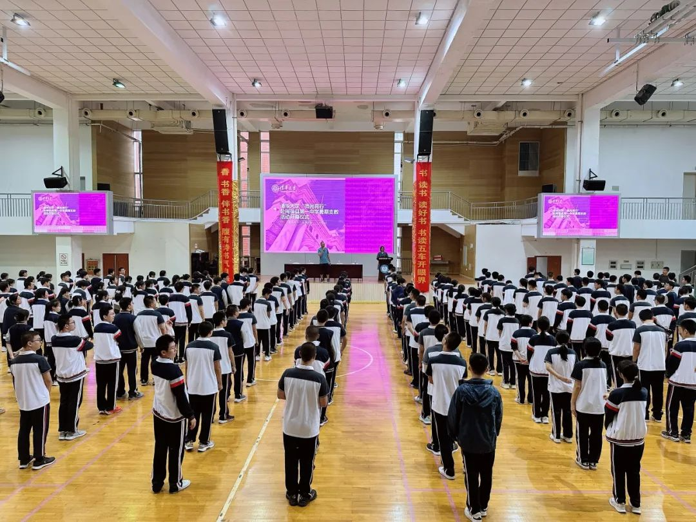

> 转载于微信公众号文章：https://mp.weixin.qq.com/s/E1vbIZSuAqTJtIxaZ9qrDA

## /开营仪式/

清华大学“微光育行”开幕式于9月4日下午在闽侯一中体育馆如期进行，闽侯一中的各位同学们来到体育馆，与探微-分21的16位同学相见。

首先，支队长**张梓杰**代表支队发言，表达了对同学的美好祝愿，希望能够在为期五天的活动中与各位学生共同进步，共同成长。 接下来，每位支队成员做了自我介绍，介绍自己对应的支教学科，希望将自己的高考学习经验以及学科优势分享给大家。其中，林琮盛学长带着与母校的羁绊，表达了这次随清华大学班级同学支教母校的兴奋与期望。 最后，支队长张梓杰介绍了这次活动的所有流程，包括学科教育课堂，主题素质教育，心灵交流等多个方面的活动，全方面的帮助闽侯一中的学弟学妹开阔眼界，提升自我。并在最后表达了对所有学子的祝福与感谢。

## /学科教育/

今天，“微光育行”团队带来的课程是高考数学、强基化学、高考物理和语文。

### 高考数学：《数形结合——解决小题压轴》

今日的高考数学课程由**王一涵**同学带来，主题是《数形结合——解决小题压轴》。王一涵同学从数形结合的方法入手，讲了运用数形结合解决问题的三类知识点：函数与不等式、复数的几何意义以及平面向量。她不仅讲了一些高考的拔高题，还在复数上进行了进一步的拓展，让同学们对数形结合的认识更加深刻。

#### <h4 style="text-align:center">感想</h4>

第一次讲课有些紧张，甚至讲着讲着会紧张地大脑突然空白，但同学们专注的目光和认真的态度感染了我，让我渐渐冷静了下来，也沉浸在知识的讲解中。课后也有很多同学找我交流题目，在与他们的交流中，我有一种双方知识体系都在不断深化的满足感，知识在交流中巩固、延伸，拓展。和同学们相互学习、共同进步是一种很美好的体验！

---

### 高考物理：《物理中质心思想的应用》

今日的高考物理课程由**单明悦**同学带来，主题是《物理中质心思想的应用》。物理课堂以参考系为切入点，先介绍了关联速度预备知识，然后讲解惯性系与非惯性系的概念，并引出惯性力的来源以及应用，对教材内容做了拓展，接下来讲解质心的概念，质心运动定理以及应用，并通过一些高考模拟题，帮助同学们理解质心思想在高中物理的应用，最后向大家简单拓展了质心系及其性质。本节课不仅为大家构建了相对完整的力学知识体系，也帮助大家用质心、惯性力的思想迅速解决并深入了解一些高考问题。

#### <h4 style="text-align:center">感想</h4>

最初接到物理授课任务时，我对自己的知识理解程度以及表达能力充满了不自信，考虑到自己对于高中知识的理解程度一定不如高中老师，并且希望发挥自己大学知识与学生视角的优势，我选择了分享一些能用在高中物理的大学知识，希望帮同学们打开视野并且加深对于高中物理知识的理解。但是在准备的过程中，我遇到了我未曾设想的困难，能讲的内容不多，高中对应的例题更少，知识点之间的逻辑过于分散，因为困难写讲义期间我多次想过改变选题，但在查阅了各种版本的大学教材以及高中教材，查找了大量高中习题之后我逐渐有了想法，最终整理出来一个我认为比较有逻辑的讲义。但在试讲过后，我发现把自己的逻辑清晰的表达出来让别人理解也不是一件简单的事，最初试讲我的表达一团混乱，感谢同组两位同学的帮助，帮我理清表达思路，让我在真正讲述之前有了一定自信。最终就是在讲台上克服社恐和紧张，最初我感觉所有人都在用审视的目光看着我，但是真正投入到思路当中就忽略了这些紧张。这是我第一次从有想法到编写讲义，到走上讲台，从无到有地完成一节课，回想起来充满了成就感。

第一次讲课还是缺乏经验，表达的清晰程度流畅程度以及时间的控制各个方面还有很多改进空间。特别感谢闽侯一中的老师们给我们提供的设备支持以及各种帮助，感谢五十多位同学的配合与包容，希望这短暂的一个小时能让大家有所收获。

---

### 强基化学：《元素与反应》

今日的强基化学课程由**侯仁哲**同学带来，主题是《元素与反应》。本次课程主要讲一些高中课内不涉及的元素知识，介绍了强基中可能会涉及到的各种元素及其性质，也拓展了元素相关理论。

#### <h4 style="text-align:center">感想</h4>

同学们或许是因为第一次见面还有些腼腆，课堂上互动略少，不过能发现大家都听得很认真。总体来说这次上课我十分快乐，能有机会把我所热爱的知识分享给学弟学妹们，是很幸福的一件事情。

---

### 语文：《浅谈情怀与格局在议论文写作中的应用》

今日的语文课程由**傅思维**同学带来，主题是《浅谈情怀与格局在议论文写作中的应用》。傅思维同学从为什么要写出格局、什么是格局意识、如何写出格局三个方面和三个年级近200名同学做了分享。同学们听的十分认真，不时拿出笔记记录，下课后还有同学与主讲人深入探讨、交流互动。

#### <h4 style="text-align:center">感想</h4>

做了这次分享，同学们身上的朝气、上进心和求知欲让我深受感动。我在这次活动中体会到的是帮助他人、传递知识的快乐。这是十分难得的经历。

---

## /答疑坊 & 心灵交流/

**阎启铭**： 在支教第一日的答疑中，我有幸走入闽侯一中的高三教室与同学们进行了学业与生活方面的交流。我的母校与闽侯一中的教育情况比较相似，在与他们的交流中，我也常常能看到高中时期的我的影子——可能面对未知的高考有些许迷茫、可能对无法攻克的重难点感到无助、也可能对学习压力下的人际关系有很多苦恼。即使我无法替他们解决所有问题，但是如果能让他们感受到温暖与关怀，我想这就是支教的意义。

**沈王瑾**： 支教第一天，我来到高二教室与同学们进行面对面交流。身处宽敞空荡的教室、私聊式的交流环境与自由轻松的氛围下，同学们从一开始的略有拘谨到逐渐放开，从各门学科的学习方法到作息时间的安排，从锻炼习惯到高中学习生活的感受，一次次的分享与畅所欲言，让我看到的不仅是同学们对于学习认真严谨的态度，更难能可贵的是对生活的热爱。或许我分享的只是一些小小的经验与故事，但若它们能在某时某刻予以启发，那便有了意义。

“再小的星子也能闪耀，微光亦能点亮前路。”

To be continued...

