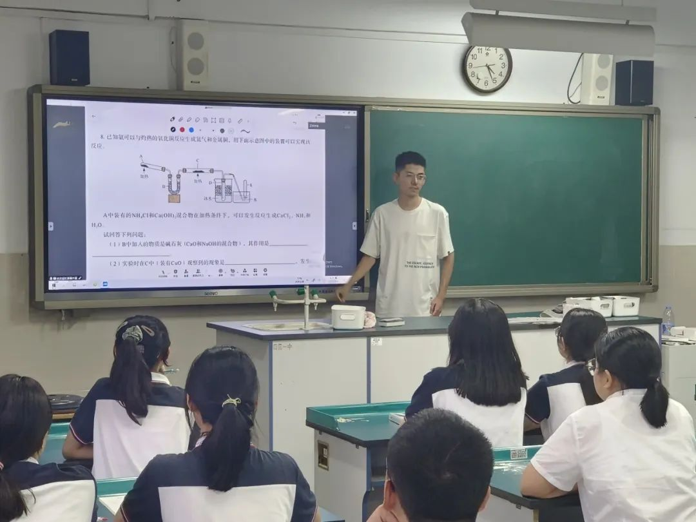
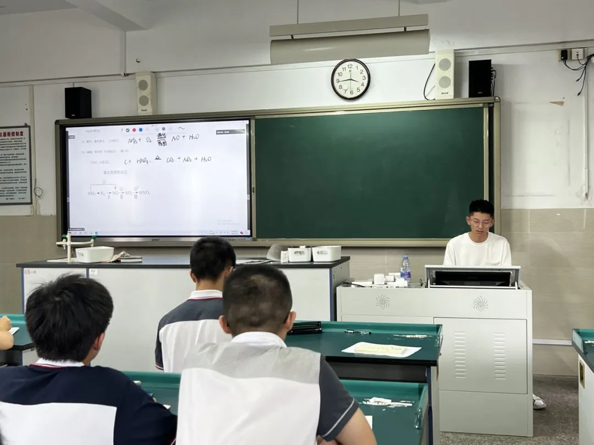
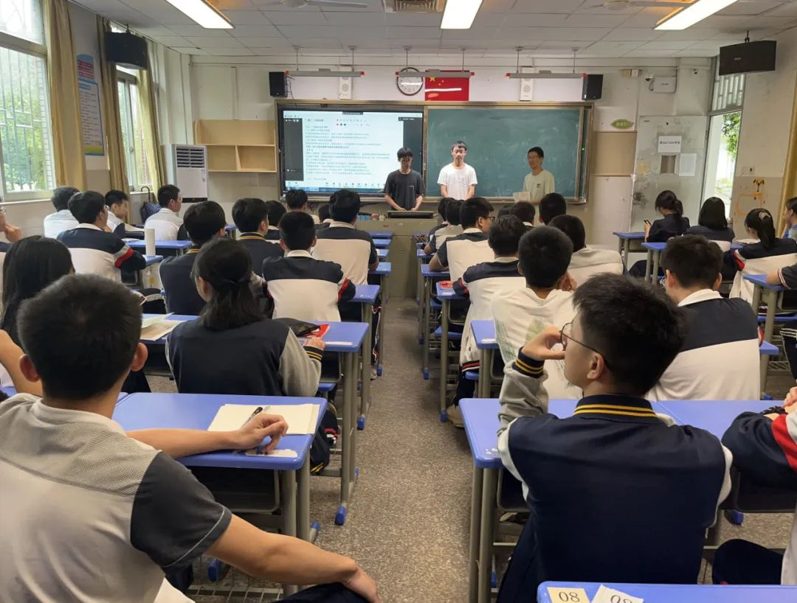
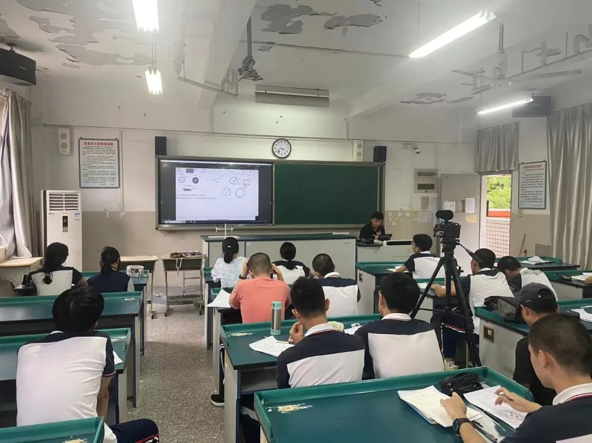
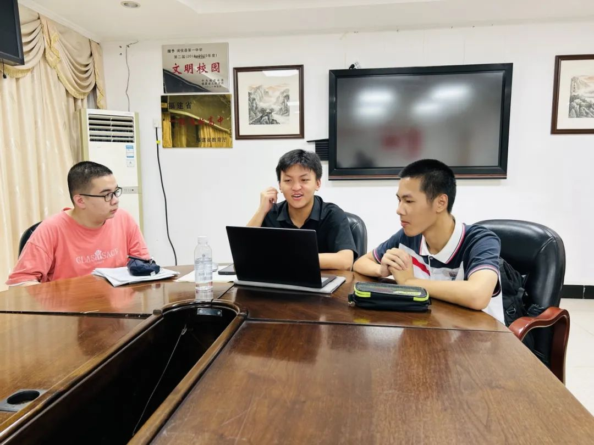
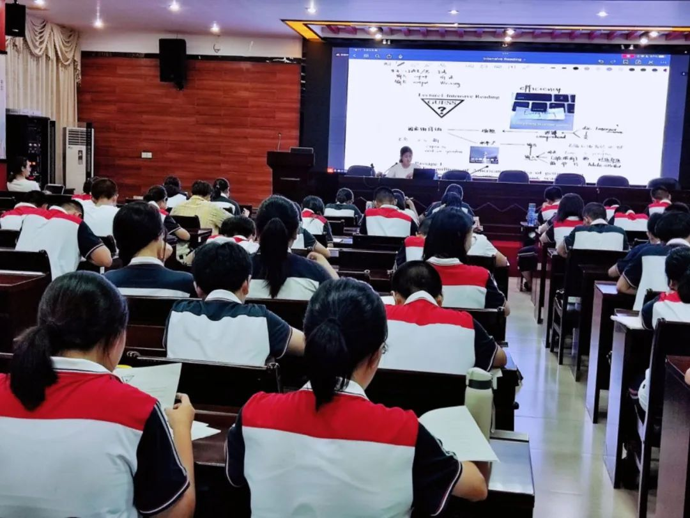
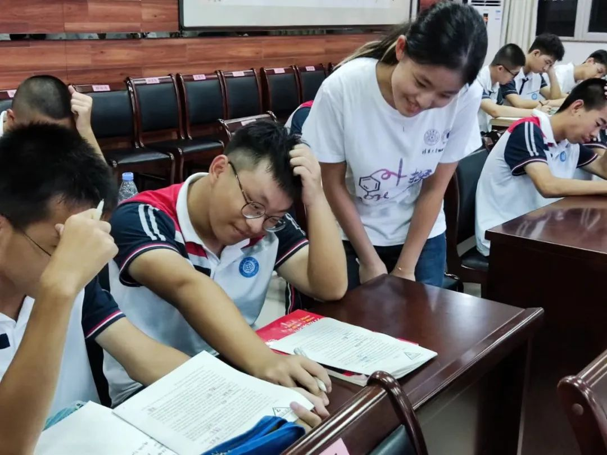
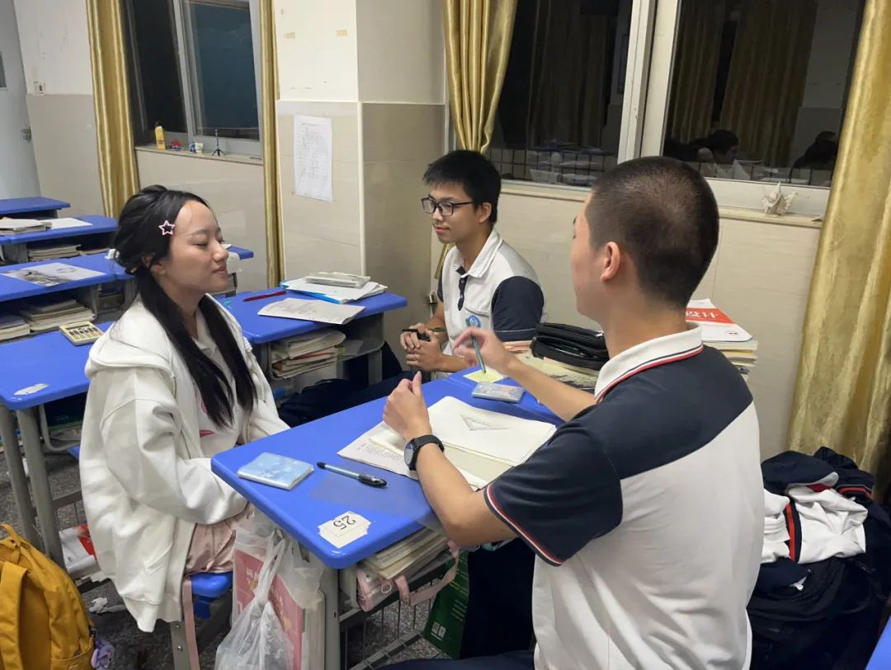

> 转载于微信公众号文章：https://mp.weixin.qq.com/s/E1vbIZSuAqTJtIxaZ9qrDA

## 参观 “3820”

9 月 5 日上午，“微光育行”支队前往福州市 “3820” 战略工程展览馆进行参观。参观完战略擘画、重大实践、赓续奋斗三大篇章，同学们了解到 “3820” 战略工程中的一个个项目及其步步落实和所带来的许多成效，也从 “一栋楼办事” 等事例中，深深感受到总书记重视民生、关爱百姓的深切为民情怀。

## 学科教育

今天，“微光育行”团队带来的课程是高考化学、高考生物、强基物理、强基数学和英语。

### 高考化学：《元素化学》

今日的高考化学课程由**史政超**同学带来，主题是《元素化学》。本节课介绍了元素化学方面的内容。对于高一学过的金属和非金属元素进行了归类讲解，同时由此推导了未知元素的性质。

#### <h4 style="text-align:center">感想</h4>

备课时对新教材进行了很多研究，但对于高中的学习状态和知识体系等依旧不够了解，因此在课前仍有些紧张，对于题目也是一改再改。课前老师周到的帮助极大地帮助我稳住了内心，而同学们积极的反应更是让我放下了所有不安。在课上同学们还给我指出了问题，让我彻底融入了同学们积极的学习氛围中，回到了高中的思维和状态中。很感谢老师的帮助，感谢同学们的积极配合，在讲课中和同学们学到很多！

---

### 高考生物：《遗传定律专题》

今日的高考生物课程由**林琮盛**同学和**刘澄澄**同学带来，主题是《遗传定律专题》。在生物课堂上，两位主讲人按照自己的解题思路，结合例题给大家进行了基因的自由组合定律的解题方法讲授。

#### <h4 style="text-align:center">感想</h4>

在这个待了三年的学校第一次自己进行一节课的准备和讲授，一开始我是十分紧张的，在课程前我还在重复准备课上的内容。但在给同学们讲解的过程中我渐渐开始抛除紧张而专注于课堂内容。虽然过程中出现了一些小问题、小插曲，但我认为结果还是十分完美的，和同学们一起学习，一起进步让我受益匪浅，希望能够在交流的过程中给学弟学妹们带来切实的帮助。同时，备课与上课的过程让我切实地感受到教师的辛苦与伟大，仅仅是三十分钟的课我便已经感到咽喉不适，我发自内心的更加尊重理解老师们。

---

### 强基物理：《角动量与刚体》

今日的强基物理课程由**刘汉清**同学带来，主题是《角动量与刚体》。刘汉清同学在课程中具体展开讲解了角动量相关知识点和较为经典的模型例题。同学们在课上与主讲人进行了丰富的互动，尽管强基的课程有一定难度，同学们接受知识也十分积极且迅速，展示了对物理学科的热爱。

#### <h4 style="text-align:center">感想</h4>

尽管强基的课程有一定难度，同学们接受知识也十分积极且迅速，展示了对物理学科的热爱。我觉得知识本身其实并没有那么重要，重要的是如何学习并在这个过程中总结出规律与理论的能力。有了这种能力，无论面对的知识和事物有多么困难复杂，都有机会将它克服与掌握。很高兴与同学们分享我所掌握的知识，我也收获到了许多。

---

### 强基数学：《不等式》

今日的强基数学课程由**王子易**同学带来，主题是《不等式专题》。王子易同学向同学们介绍了一些经典的不等式，分享了解决不等式相关问题时常用的技巧，以及不等式证明和求最值问题的常见思路，并辅之以例题讲解。课程主要涉及课内拔高难度的内容，在课内基础上进行了拓展。

#### <h4 style="text-align:center">感想</h4>

在讲课的过程中，我经历了一个逐渐投入的过程，也能感受到同学们都听得很认真。课后也有同学来找我交流相关问题。我感到这是一个共同进步提升的过程，来到这里与大家分享知识，是我的荣幸。

---

#### 英语：《精读专题》

今日的英语课程由**王子易**同学带来。主题是《精读专题》。王子易同学从如何读懂一篇文章和如何充分且高效地利用阅读材料丰富自身积累两方面与三个年级约180名同学作分享。通过对示例文章的讲解，她介绍了如何充分理解一篇文章，并强调了英语学习中注重拓展延伸的基本思路，向大家分享学科经验。

#### <h4 style="text-align:center">感想</h4>

起初，面对报告厅中近两百名学弟学妹，不免感到紧张。然而，同学们认真地阅读我准备的阅读材料，思考问题，并与我进行互动，让我逐渐沉浸于分享的快乐中。课后也有很多同学找我交流英语学习方面的问题。我希望自己所提供的学生

---

## 答疑坊 & 心灵交流

**刘雨轩**： 和高三几个“作文特困生”交流了语文写作，也是给后一天的语文讲课内容进行了预演。得到了一些很珍贵的学生们对内容的看法，也为正式上课提供了一些例子。大家非常真诚地将自己的文章、想法告诉我，我再将自己的看法和见解与他们交流，一来一回的互动中一个半小时很快就过去了，这让我十分意外，大家真诚而又热情，这也让我更加想要将自己的东西告诉他们。总而言之，是一次很愉快的体验！下次还来！

**刘宽**： 「我望着他们，一如望着曾经的自己。」 &emsp;&emsp;自毕业于黄高后，我就再也没踏回过那个让我内心五味杂陈的校园。这其中，既有遗恨与残念，也杂着羞赧与惭愧。「也许现在还不是时候。」，我如此慰藉着自己。庆幸的是，暑期一次寻访闽侯一中的「支教」活动让我获得了一次重返高中校园的机会。 &emsp;&emsp;第一天的行程并不复杂，先是开营仪式，再便开始讲课，最后晚上交流答疑。风雨前的天气尚是明媚，虽有小雨，但学生热情不减，开营时掌声十足，解散后也是在楼体间相互称道。之后的授课则是画风一转，严肃的教室内，学生多是专注课堂，缄默于笔记，沉思于问题，下课亦是驻留于教室，提问讨论。最后的交流答疑，应该是我参与度最高的一个环节了，首先是寒暄，然后是短暂的沉静，再之后，大家渐渐聊开，从学习规划到学科学习，从时间安排到高中生活，渐是平易，渐是真切。 &emsp;&emsp;高中时期的我擅长理科，对文科的投入多是被动的进行，高中我是相当激进的，大部分时间都执着于对擅长科目的精益求精，虽然高中我创造了相当多的辉煌，但讽刺的是，高考最后拉我的是我的双语，虽然成绩称不上高，但中庸的水平对于理科失准的我也够用了，边际效益带来的是更大的风险与相对更少的回报。某种意义上，高考是个投资的过程，收益最大化和效能最大化就是我们需要权衡的东西。 &emsp;&emsp;说来我没有回答太多学习上的问题，掌握知识应一是接触，二是训练，二者结合便可理解熟谙，于我而言，很多不再必要的知识已经弹出了记忆，这更是说明了高中学习中接触与训练的必要性。 &emsp;&emsp;「学长学姐的高中生活是怎么样的？」要说这句话是最拨弄我的，少有表达欲的我几乎脱口而侃。从早六到晚十的生活贯穿了我的高中三年，比起早八晚九，这种生活似乎更是乏味，不过我到觉得高中相当自在与快乐。这倒不是我所体验的痛苦少了，应该说，对快乐与释放的留念也同样贯穿了我的高中生活，一如村上所说「痛苦难以避免，而磨难可以选择。」现如今我的高中的知识多是遗忘，能一一道来的反而是高中学业上的逸事趣闻，我高中时没少挨罚，但快乐的事也一件没落。如果说十八岁是最信仰尼采的年纪，那么也最好记住尼采的另一句话，「信仰就是不愿相信真相。」显然，我对我高中的评价并不是我真实的高中生活，在迷茫失落与郁结悲伤的波折中才是大多数高中生的正常状态，但那有何妨呢，我所记住的虽是为数不多的快乐与狂欢，但对于明天，已经够用了。在回看时，其间种种，已是趟过一座座山、一江江水。 &emsp;&emsp;「上进」的氛围是最能打动人的，穿行楼宇间忙碌的身影，交流时腼腆的神色，提问时跃动的思维……那些高中生独具的气质仿佛久酿的陈酒揭盖，沁弄人心。我相信这是最好的高中生状态，虽然很多人往往不自知，也身出迷茫之中，但请葆有一份朴素的热情，那便是向上的车轮，载着追求卓越的人驶向卓越。

To be continued...

