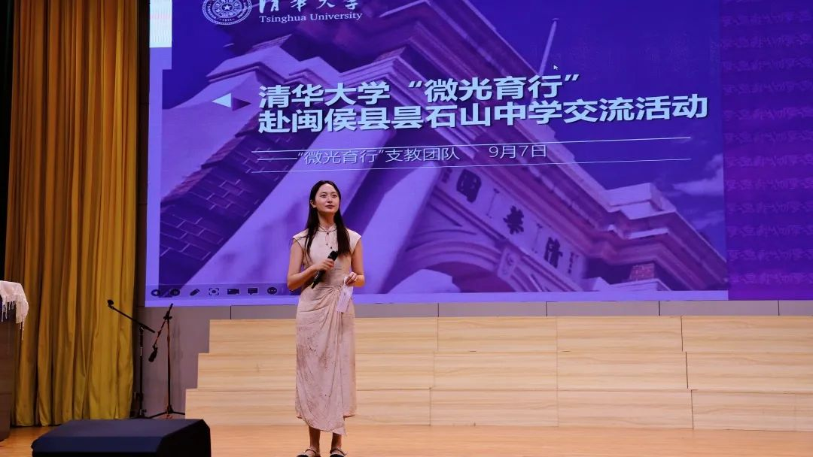
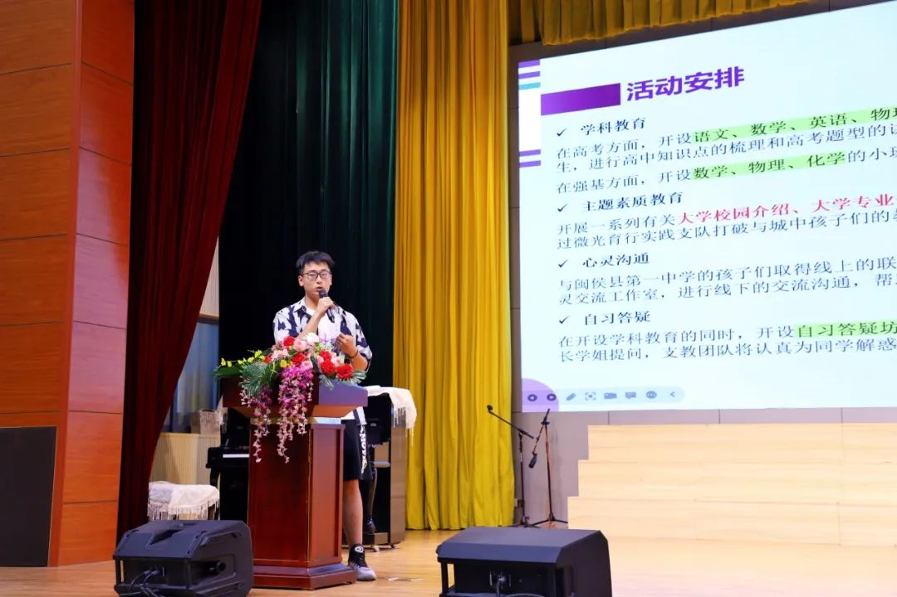
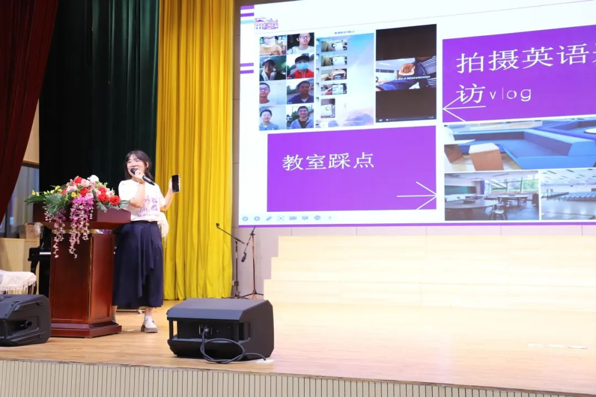
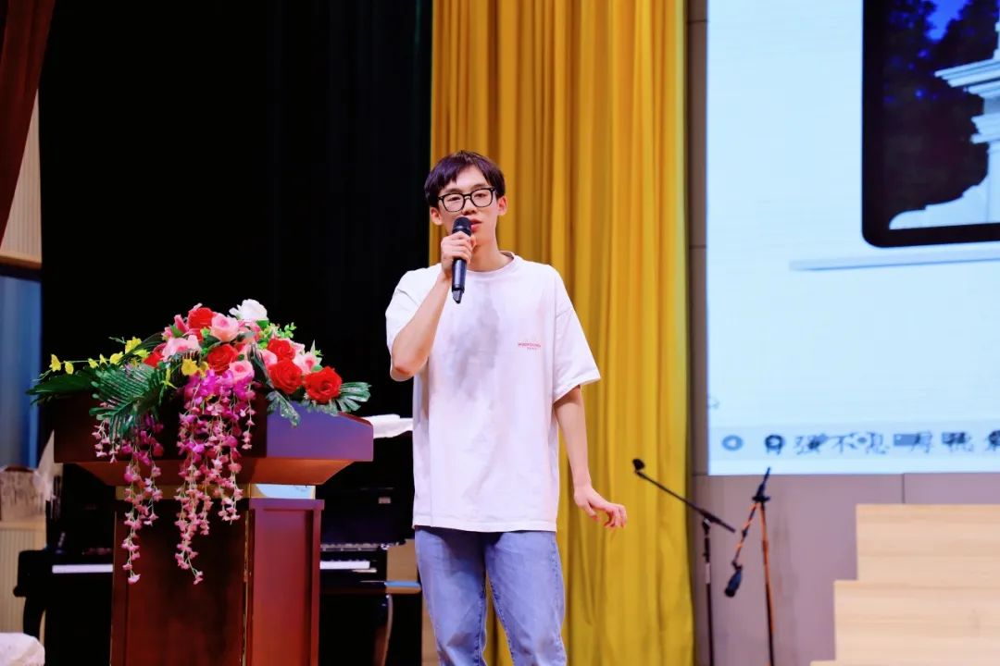
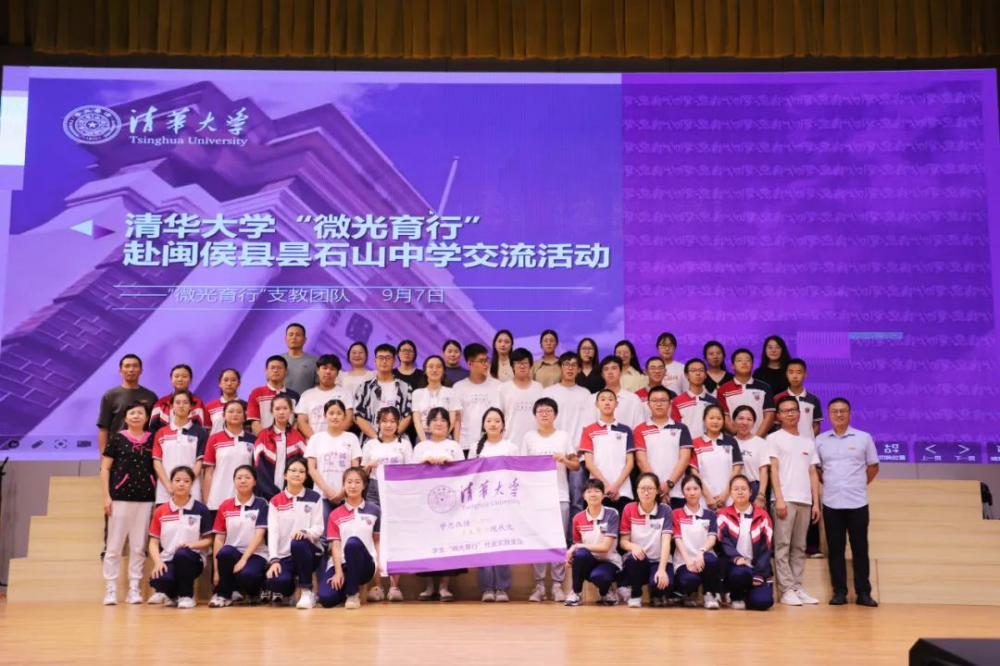
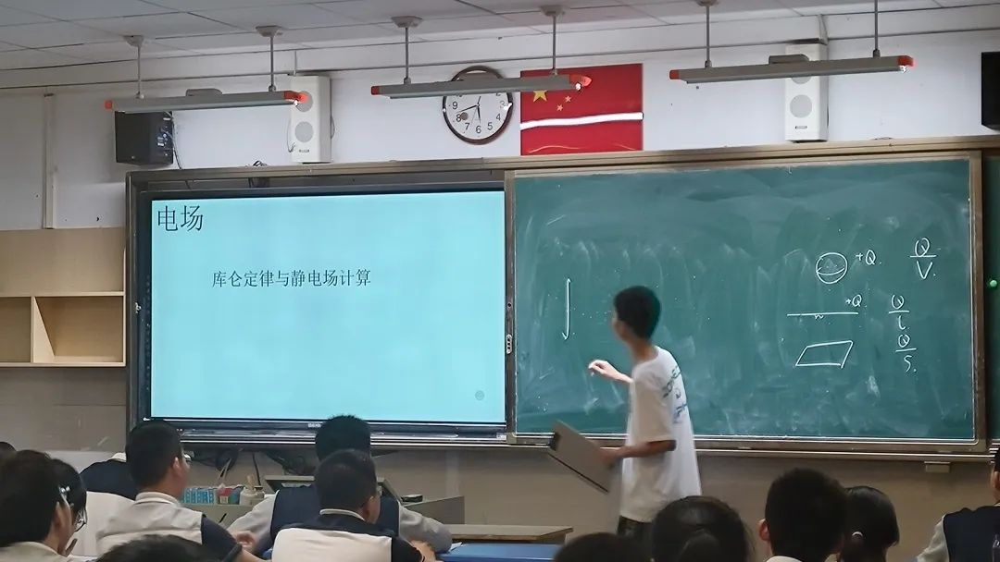

> 转载于微信公众号文章：https://mp.weixin.qq.com/s/aoRYjFVM2QgOgEKZw93M9A

## 宣讲交流

9月7日下午，“微光育行”支队抵达昙石山中学，面向昙石山中学九年级学生开展经验分享会。

张梓杰同学首先为昙石山中学的学生们介绍了“微光育行”暑期支教实践支队的创建原因，以及这几天在闽侯县第一中学的支教活动内容。

接着，王一涵同学从课堂听讲，学习方法，考前复习，心态调整等方面分享了她的初三学习经验。另外，王一涵还分享了她的一些高中生活和大学生活，勉励同学们珍惜现在的时光，积极进取，不负青春。

随后，林琮盛同学介绍了初高中衔接的相关内容，从思维方法、学习习惯、生活掌控和建议四个部分结合自己的初高中经历对同学们进行了分享，帮助同学们了解初高中的不同，更好地进行过渡。

最后，支队成员与学生代表进行问答互动，解答同学们关于学习和生活上的困惑。

支队成员与昙石山中学师生代表合影

## 学科教育

### 高考物理：《电学：静电场拓展》

今日的高考物理课程由刘宽同学带来，主题是《电学：静电场拓展》。本节课是一堂比较轻松的物理课，刘宽同学在开头提到了一些会用到的高等数学工具，并按照电荷-电场-介质和电容依次展开，最后做了一个总结，并通过在黑板上做图的方式进行列示和说明，然后询问大家是否理解，根据大家的反馈和细碎的答复进行之后的展开。

#### <h4 style="text-align:center">感想</h4>

  

    
「在如期而至的教室，进行一场酝酿已久的邂逅。」

  

  

    
课前走错了教室，在上课前一两分钟才急冲冲地走上了讲台，虽然课前课上和课后出了很多差错，不过好在学生很热情，尽管我不认识每个同学，不过大家的互动和吐槽真的很有感觉，一下子讲课就上头了（doge。下课的时候有同学跑过来跟我打趣到：「学长刚才是不是很紧张，我看你总在擦黑板。」讲真其实还好（汗），课前演练的时候一直担心会发挥不好，不过一上讲台后那种扑面而来的熟悉感和亲切感一下就涌入到身体各部。作为一个表达欲旺盛但又喜欢极度克制的人，这种专注且活跃的课堂一下就点燃了我的热情，整节课基本上我是想到哪讲到哪，照着一个粗略的 ppt 大纲「大展拳脚」。

    
这节课整体上是一节比较轻松的课堂（may just i think），虽然课程会有一定难度（比较深刻的一个学生评价是「把“1+1”讲成了矢量积分的感觉」），其间也涉及到了相当多大学的思维和逻辑，不过我觉得这节课一不在于计算，二不在于公式的背记，而是重在逻辑思维的互动，有时候讲到一些比较精彩的推导时，下边同学也会跟着起哄，其实我觉得这挺好的，大家爱听我就多讲点，稍微劝一下教室就静下来了，我感觉学生们真的有在专注我的课堂，而且或许是学长身份的原因吧，虽然我身形矮小，声音也不大，有时还会手舞足蹈（源自我的高中老师z），但我一提醒教室就瞬间安静了下来，虽然不知道听课的学弟学妹怎么想，不过这种有来有回的课堂氛围真的是我讲课最期待的氛围。

    
我也希望这次短暂的课堂邂逅能起到一个抛砖引玉的作用，我始终坚信思维和逻辑乃是学习和做题的基石，正如那句「思想走在行动之前，就像闪电走在雷鸣之前。」用更体系化而非体制化的思维来思考知识，一定可以让行动走得更远。最后，感谢老师和同学的积极配合和互动，预祝大家在未来变得更强，走得更远。

    
「Just take a step, and deserve to the encounter.」

  

### 高考化学：《热化学&电化学初步》

今日的高考化学课程由赵卓凡同学带来，主题是《热化学&电化学初步》。主要带领同学们梳理了化学反应速率，原电池和电解池相关的知识点和常规考点例题，以及拓展了一些相关的深度知识，和对于一些结论的推导。同学们互动积极，对问题也有主动的推理和思考。

#### <h4 style="text-align:center">感想</h4>

给同学们讲授自己曾经学过的知识以及一些学习解题的心得体会，既激动又感慨。当在课上得到同学们一次次积极互动的反馈，我知道这些内容是有帮助到同学们的，便感到十分荣幸。

### 强基数学：《强基试题中的猜测、试验和目测》

今日的强基数学课程由张梓杰同学带来，主题是《强基试题中的猜测、试验和目测》。数学强基课程从试题入手，通过运用数学中检验猜测的思想，向同学们介绍了如何巧妙应付强基和竞赛试题的策略。同学们面对题目一开始认真思考，接着主讲人详细的为他们阐释方法，大家一直在认真听讲，认真思考问题。

#### <h4 style="text-align:center">感想</h4>

作为一名已经大二的学生，准备高考或强基课程是不易的，高考和强基对于我来说已经过去两年，对于题目的不熟悉会导致我没法向学弟学妹传授最好的东西，所以我不断的去做题，选题，为了选出这次强基课程的八道题我做了比我准备强基考试还要多的题哈哈，但是真的希望我能够帮助到他们，尽我所能找到最具有代表性的题目，向他们介绍数学强基里的猜测思想。不过第一次讲课，还是觉得自己有些部分讲的有点快，希望下次好好的和学生互动，让他们最大程度的吸收。我觉得学生们那种求知的态度十分让我怀念，我发觉他们眼里有光，他们不断的去思考，最终一定可以实现自己的梦想！

### 强基物理：《物理中的热学难题》

今日的强基物理课程由刘汉清同学带来，主题是《物理中的热学难题》。鉴于热学部分的高中内容仅仅是进行了一个铺垫，刘汉清同学拓展了一些大学课本中的内容，讲了一些有关于分子热运动和有关热力学两大定律的知识与题目。

#### <h4 style="text-align:center">感想</h4>

虽说讲的可能有些不够细致，但同学们都十分积极接受新知识并做了详细的笔记。我认为这几天的讲课经历十分难得，不光能让我掌握的知识传授给更多的同学，我自己也收获许多。从备课到讲课是一个十分漫长的过程，从讲义的编写开始，到一次次课前反反复复的试讲和修改，我收获了一段不同寻常的经历，也让我感到老师们平时所付出的努力。值此教师节将临之际，祝闽侯一中，祝全天下的老师们节日快乐。

### 英语：《写作专场：头脑风暴》

今日的英语课程由沈王瑾同学带来，主题是《写作专场：头脑风暴》。沈王瑾同学从写作文时常遇到的困境切入，引出头脑风暴这一技巧，随后结合实例给同学们示范如何进行头脑风暴。通过四道作文例题，她介绍了如何通过发散思维进行头脑风暴，并从中择优构建文章。

#### <h4 style="text-align:center">感想</h4>

对着几乎座无虚席的180人大教室讲课是一种很新的体验，新在视角，新在过程，新在心境。备课试讲的时候以为时间撑不满，调整后正式讲的时候出乎意料的顺利，每篇一刻钟正好一小时，抛出问题时前中排的同学们会很积极响亮地回答，有时思路还会令人眼前一亮，这样的互相呼应让整节课得以顺顺利利推到结束。很珍惜这次走上讲台的机会，也很高兴自己分享的内容能给大家带来启发^ ^

### 答疑坊 & 心灵交流

**江宇萱**： &emsp;&emsp;在完成了语文讲堂之后，我进入了班级和许多同学面对面进行了一对一的作文经验交流。和备课内容相对应，高三学生最近的一次模拟考试的作文题正是课堂中提到过的辩证类题目，于是我和来交流的同学们详细分析了他们的考场作文，根据大家写作水平的层次给了不同的提升建议和改进的方向。大家交流很活跃，随着时间推移逐渐变得愈发热情，大家也交流到了很多语文学习本质上的问题。 &emsp;&emsp;虽然已经一年没有在考场上紧急地写作文了，但在教室里看到熟悉的答题卡、在整理资料时看到自己写过的考场作文，高中应试的本能好像又被激发出来。我不能教授大家怎么写每一篇作文，但这些在“本能”里的“投机”技巧或许是更加珍贵的心得体会。希望大家都能做应试作文的战神！

**刘澄澄**： &emsp;&emsp;这次和闽侯县第一中学的同学们进行心灵交流，感触很深。大家都还是在高中学习的同学们，有的也许还对高中的未来充满迷茫。但是他们都透露出一种对未来的向往与朝气，有的是新高一的同学就确定了自己的喜欢的学科方向并为之努力，有的是新高三的同学虽然学习很忙，但也乐于了解自己喜欢的知识。每一个同学的未来都值得去完成自己的梦想。这一方面体现了本次支教活动的意义，去帮助那些可能教育资源相对没那么好的地区的同学，另一方面也回温了我自己在高中的梦想，激励我继续坚持走下去，切莫愧对当时踌躇满志的自己。

To be continued...

