d---
title: 微光育行 | 序
date: 2023-08-26
updated: 2023-08-26
categories:
  - 行记
tags:
  - 行记
hide: true
---

> 转载于微信公众号文章：https://mp.weixin.qq.com/s/FnsxjyA2Yx40LJnan8gG2w

## 支队 & 目的地简介

春风化雨，润物无声；微光照路，且育且行。探微-分21的16名同学组成“微光育行”支队，希望利用清华大学支教团队丰富的学科优势为福州市闽侯县的孩子们带来切实可行的帮助；同时也希望与主题素质、心理、传统文化教育相结合，与孩子们取得长期联系，将支教的影响和作用做到最优最大。

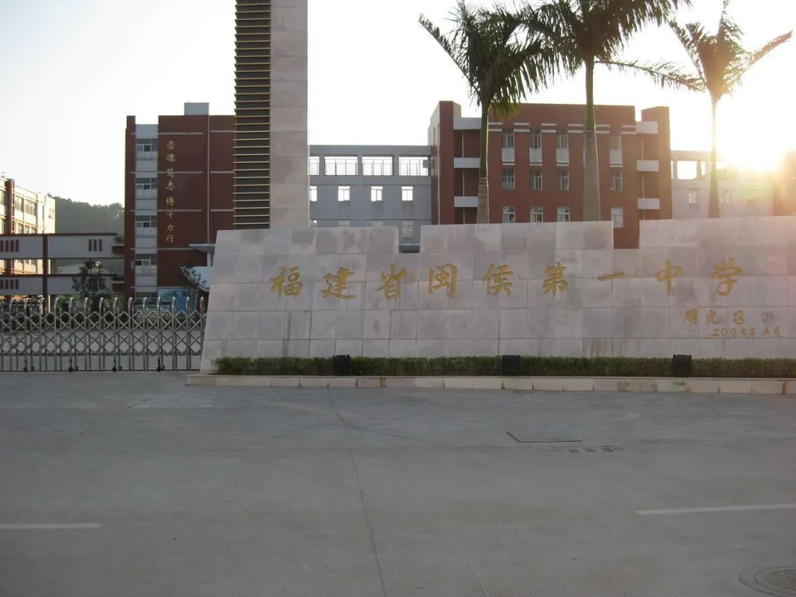

闽侯一中是一所具有百年历史的名校，源自福州三牧坊，始于1902年的“全闽大学堂”。抗日战争期间的1938年春，迁往福建省沙县城关文庙继续办学。1943年9月迁址闽清六都（坂东）。1945年7月更名为福建省立闽清中学。1950年7月，学校迁往闽侯县南屿镇，定名为福建省闽侯中学。1954年7月，迁至闽侯专署所在地螺州附近的城门三角埕办学，定校名为福建省闽侯第一中学，1970年春，闽侯县行政机关迁到甘蔗镇，闽侯一中也随迁至甘蔗至今。历经百年沧桑岁月，几代人艰辛耕耘，校址、校名几经变更，但育人宗旨却始终不渝，薪火相传。

## 实践内容

### 学科教育

- 高考：开设语文、数学、英语、物理、化学、生物的高考学科教育课堂，主要面向在校高一高二高三的学生，进行高中知识点的梳理和高考题型的讲解

- 强基：开设数学、物理、化学的小班强基辅导，为希望参加竞赛和准备强基考试的学生进行辅导

### 主题素质教育

开展一系列有关大学校园介绍、大学专业介绍、高中学习规划、高中心态管理等主题素质教育课堂，让孩子们通过微光育行实践支队打破与城中孩子们的教育信息壁垒，开阔眼界树立理想。

### 心灵沟通

在支教期间和支教活动前后与闽侯县第一中学的孩子们取得线上的联系，与清华大学的学子们敞开心扉交流高中学习生活中的烦恼，在支教期间开设心灵交流工作室，与孩子们进行线下的交流沟通，帮助孩子们了解大学生活开阔眼界。

### 自习答疑

在开设学科教育的同时，开设自习答疑坊，答疑坊开设线上线下通道，欢迎自习期间的在校学生向支教团队的学长学姐提问，支教团队将认真为同学解惑答疑，同时利用微信群或其他网上平台欢迎同学给出问题。

### 户外素质拓展

支教团队计划在学生空闲时间为学生们开展户外趣味娱乐和结合福州当地特色文化的兴趣课程，增加支教活动的趣味性和人文关怀。

## 成员简介 & 实践期望

### <h3 style="text-align:left">&emsp;&emsp;&emsp;&emsp;侯仁哲 | 化学</h3>

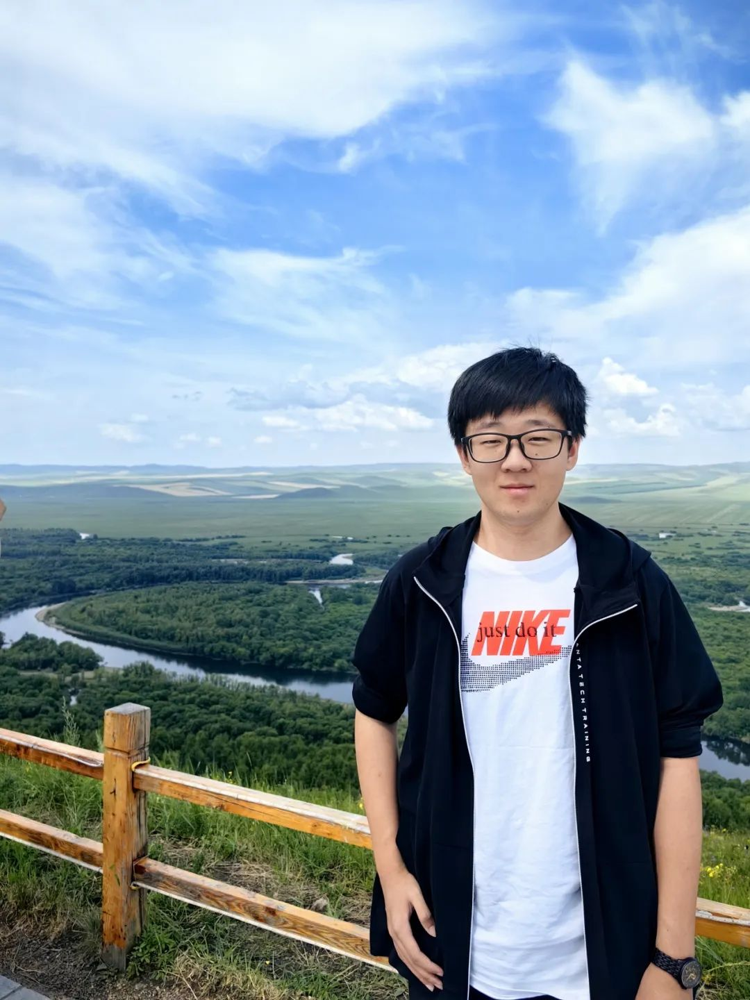大家好，我是来自探微书院分21班的侯仁哲，在本次支教中负责强基化学部分的授课。作为前化竞生，在即将到来的支教活动中我会尽我所能讲好这三节课，助力各位同学百尺竿头，更进一步。

### <h3 style="text-align:right">林琮盛 | 生物&emsp;&emsp;&emsp;&emsp;</h3>

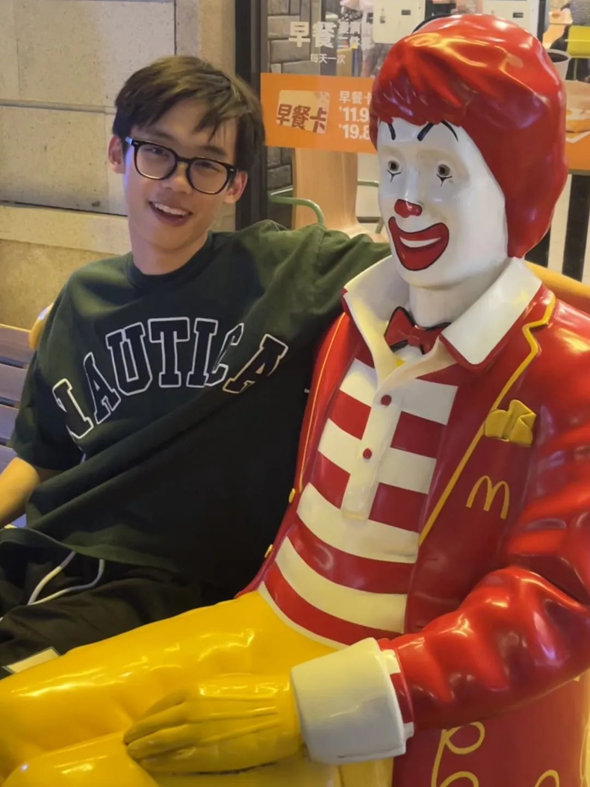我是来自探微-分21的林琮盛，也是闽侯县第一中学202届毕业生，本次实践活动主要负责生物部分的教学。希望这次实践活动能给学弟学妹们带来帮助，和大家一起进步～

### <h3 style="text-align:left">&emsp;&emsp;&emsp;&emsp;赵卓凡 | 化学</h3>

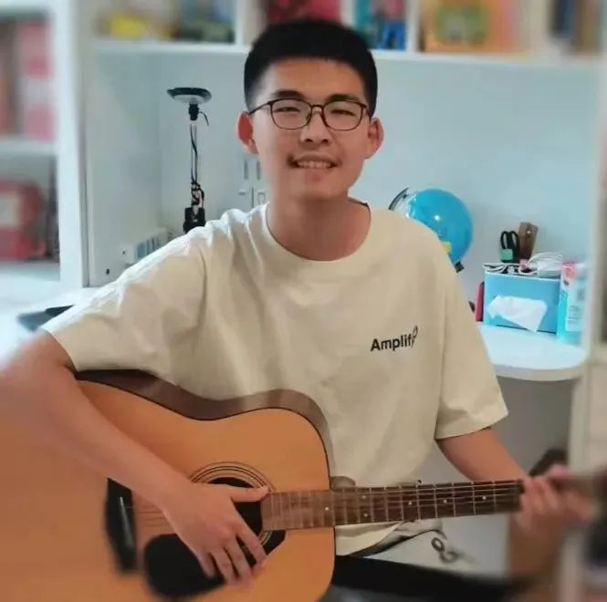大家好！我是探微-分21的赵卓凡，本次支教负责化学科目。十分期待这次支教活动，期待和学弟学妹们见面交流～

### <h3 style="text-align:right">傅思维 | 语文&emsp;&emsp;&emsp;&emsp;</h3>

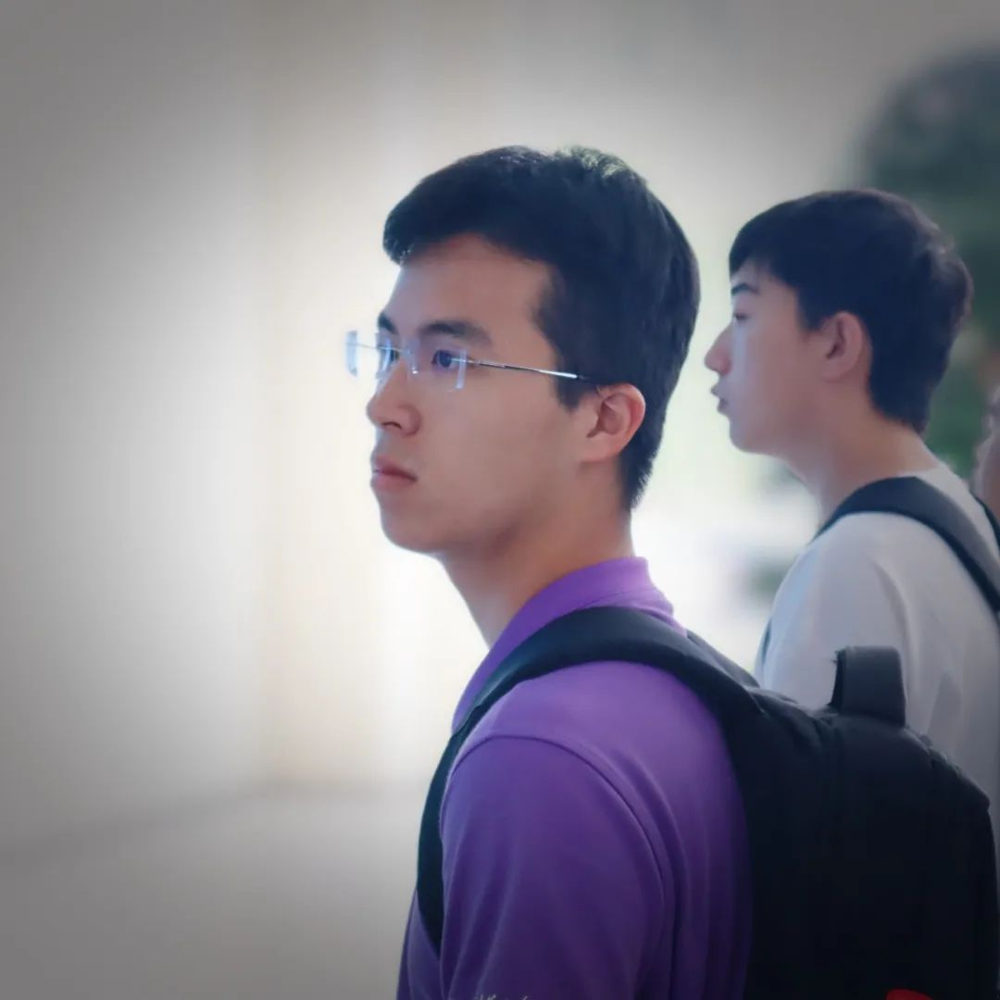hello 大家好，我是傅思维，在本次实践活动中负责部分语文学科教学工作~这一假期一直在和小朋友打交道哈哈哈，期待能和这次的小朋友们共同成长，并且收获助人圆梦的喜悦与满足～

### <h3 style="text-align:left">&emsp;&emsp;&emsp;&emsp;史政超 | 化学</h3>

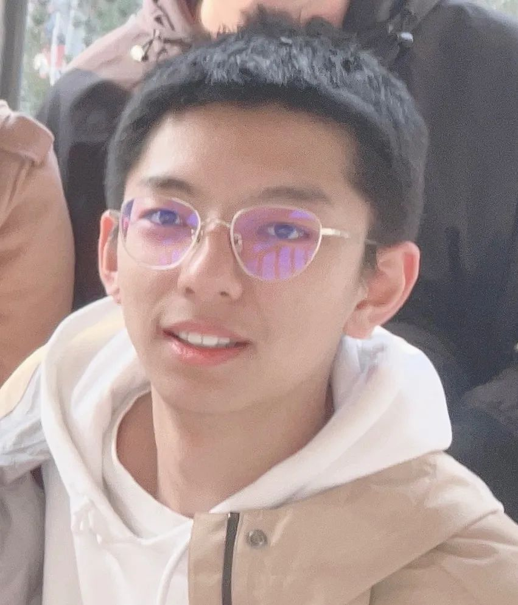大家好，我是史政超，这一次和大家探讨高中化学问题。希望能给大家带来一些启发，也希望在交流中有更多的思考。

### <h3 style="text-align:right">沈王瑾 | 英语&emsp;&emsp;&emsp;&emsp;</h3>

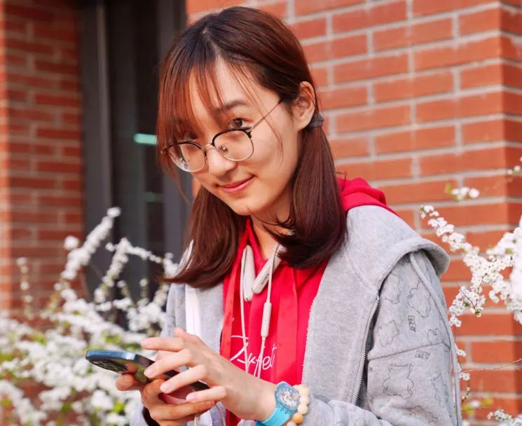Hi 大家好，我是沈王瑾，将会在英语学习中与大家同行。 Looking forward to meeting you :)

### <h3 style="text-align:left">&emsp;&emsp;&emsp;&emsp;叶子 | 英语 & 数学</h3>

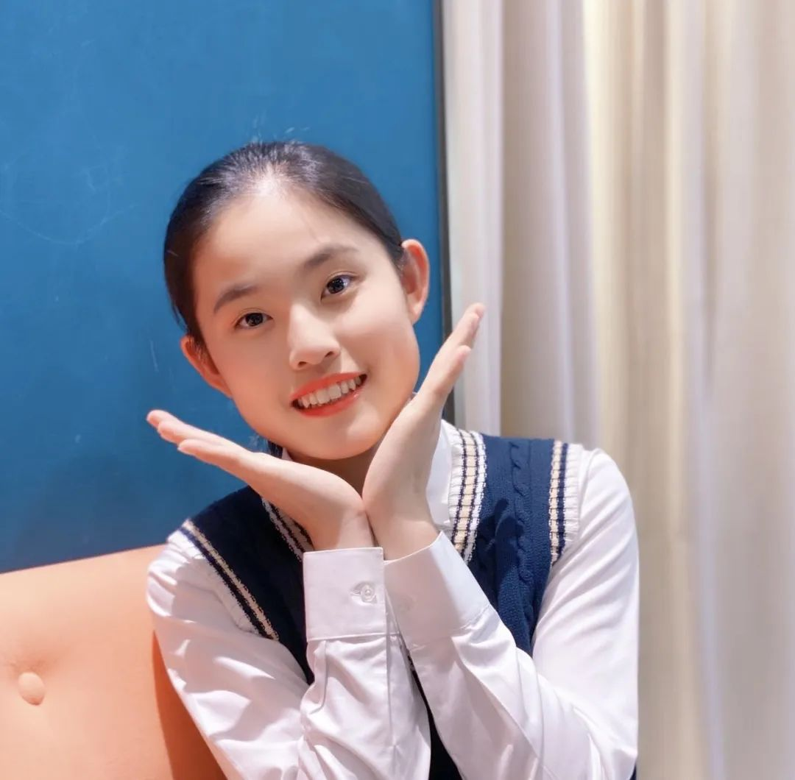大家好！我是探微-分21的王子易，来自上海，很高兴能参与此次活动，希望能和大家一起度过一段有趣而有意义的时光～

### <h3 style="text-align:right">单明悦 | 物理&emsp;&emsp;&emsp;&emsp;</h3>

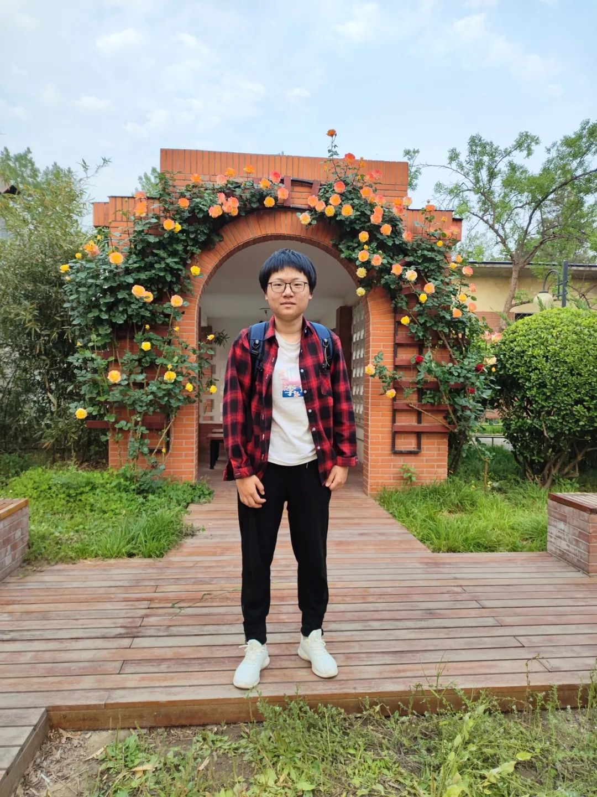我是探微分21班单明悦，来自黑龙江哈尔滨，这次负责的科目是高中物理。希望能跟大家多多交流，也希望能通过我个人的高中经历以及可能不那么成功的高考经历启发大家，帮助大家，希望和大家一起学习，共同进步。

### <h3 style="text-align:left">&emsp;&emsp;&emsp;&emsp;江宇萱 | 语文</h3>

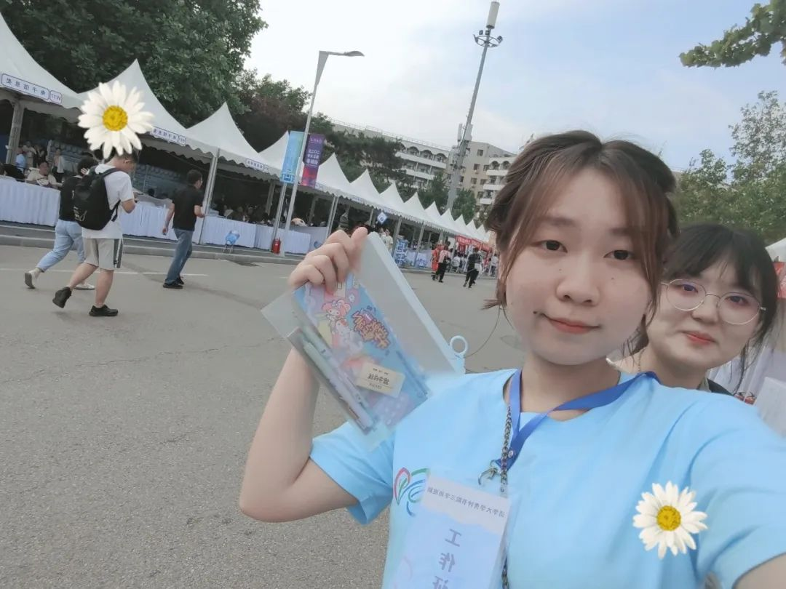Hello₍˄·͈༝·*₎◞ ̑̑我是江宇萱，来自探微书院二字班高分子方向。爱好是去线下音乐现场听各种形式的音乐，也包括音乐剧，冲浪海域非常广阔，喜欢探索新的领域！这次实践负责语文写作方面的一点经验分享～期待和大家一起完成本次实践！

### <h3 style="text-align:right">刘雨轩 | 语文&emsp;&emsp;&emsp;&emsp;</h3>

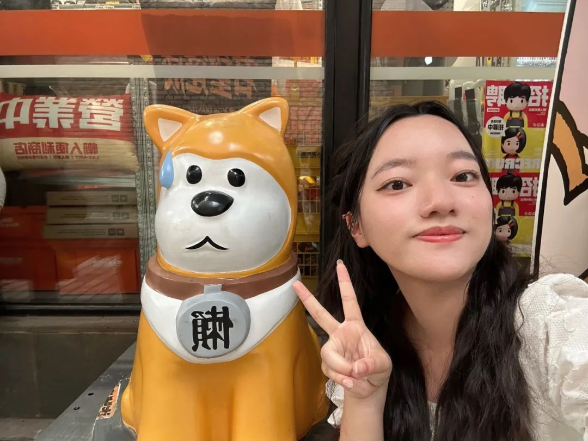大家好我是刘雨轩～在这次的支教活动中负责语文教学工作～希望在这次的活动中能将自己的学习经验分享给大家，为大家带来更多帮助！

### <h3 style="text-align:left">&emsp;&emsp;&emsp;&emsp;王一涵 | 数学</h3>

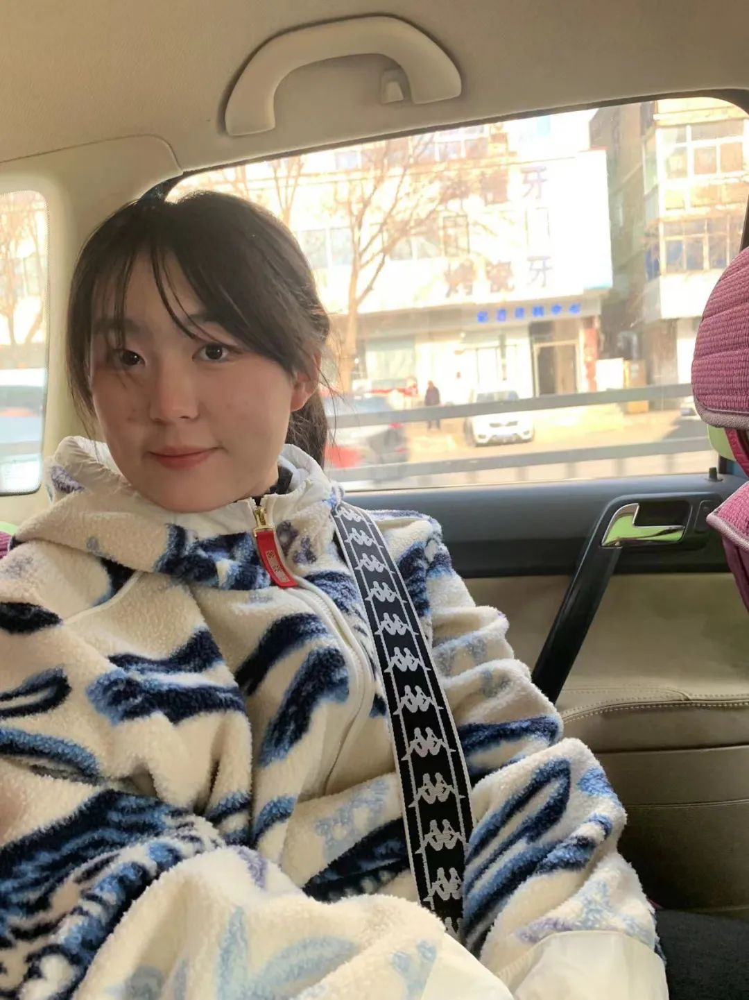大家好，我是探微-分21的王一涵，负责数学小组～非常期待本次支教实践！期待和学弟学妹们成为朋友，也期待了解闽侯县当地的风土人情哇！

### <h3 style="text-align:right">刘澄澄 | 生物&emsp;&emsp;&emsp;&emsp;</h3>

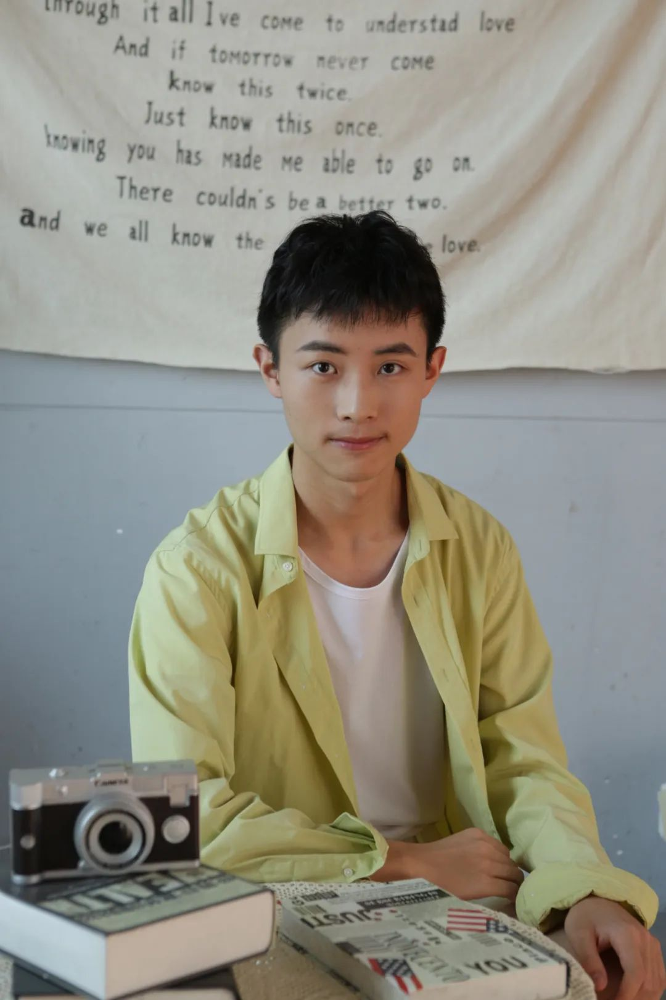我是刘澄澄，来自探微书院分21班，在本次支教中主要负责生物学科，不太敢外向但是会很喜欢聊天，平时也比较喜欢！希望能够在本次实践中尽可能地帮助同学们，也让自己收获满满！

### <h3 style="text-align:left">&emsp;&emsp;&emsp;&emsp;阎启铭 | 数学</h3>

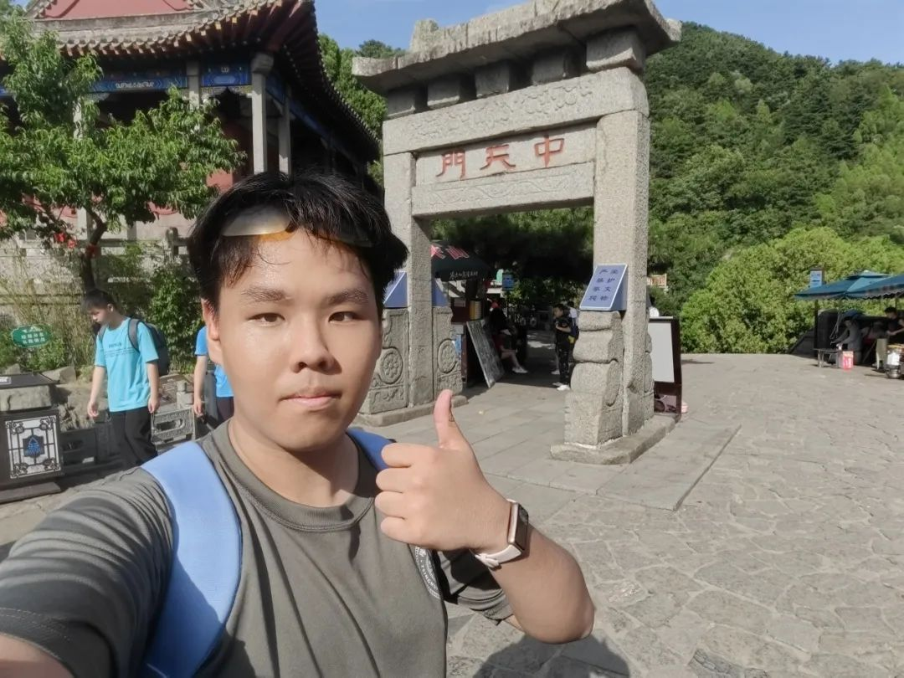大家好，我是来自清华大学探微书院的阎启铭，产地山东淄博，负责本次支教的数学科目，希望认识更多的小朋友，与大家互相学习，一起进步！

### <h3 style="text-align:right">张梓杰 | 数学&emsp;&emsp;&emsp;&emsp;</h3>

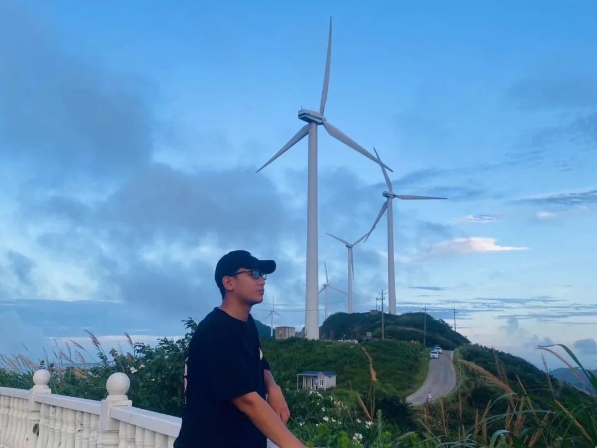大家好！我是来自清华大学探微书院的，专业是化学生物学禹高分子材料工程，很高兴这次前往闽侯县第一中学开展我们“微光育行”支教活动，我负责的科目是数学，非常希望认识很多学弟学妹！大家有什么问题都可以问我，也可以约我唱歌，打篮球，我都会一点点（嘿嘿），期待和大家的见面哦

### <h3 style="text-align:left">&emsp;&emsp;&emsp;&emsp;刘宽 | 物理</h3>

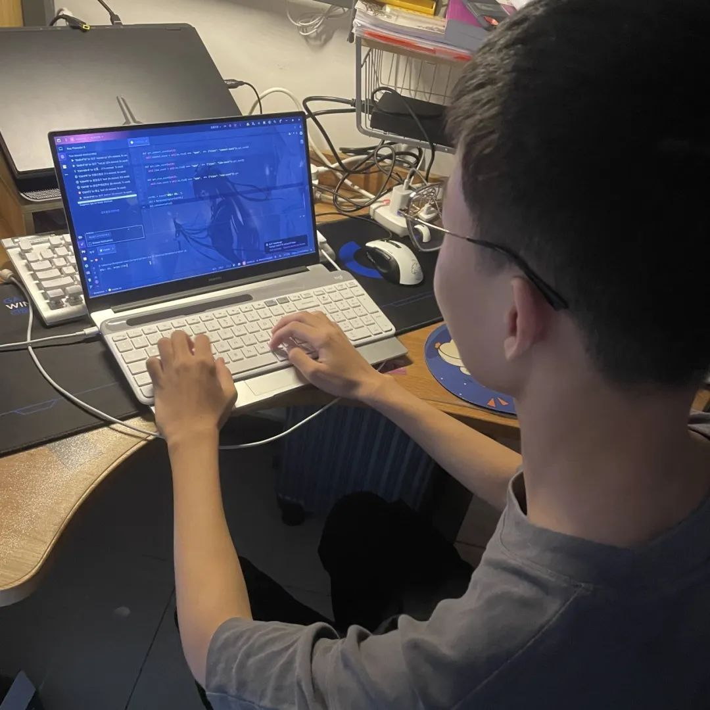大你好，我是刘宽，来自探微-分21班，在本次实践中负责打杂x，将为大家带来高中物理和一些大学电磁部分知识的讲解。性格随和，但不喜言辞，喜欢和大家一起讨论问题，平时一个人喜欢捣鼓自己喜欢的项目。高中是理科尚可的四边形选手，大学就…（笑，会点编程，爱好前端，熟练掌握计算机与服务器的开关和重启x，希望能在此次事件中解答大家的问题，交流学习方法，共同成长。

### <h3 style="text-align:right">刘汉清 | 物理&emsp;&emsp;&emsp;&emsp;</h3>

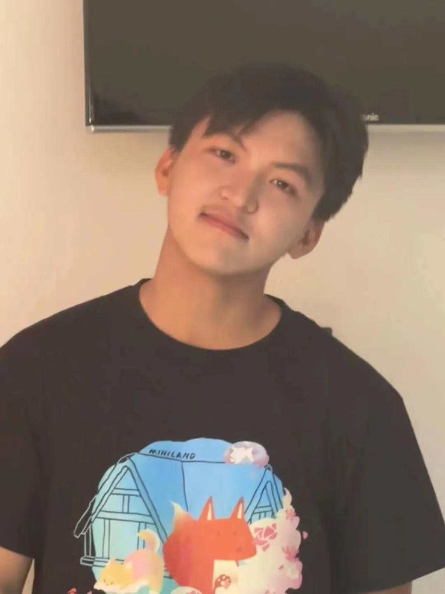大家好，我叫刘汉清，来自探微分21。本次实践负责物理以及物理强基科目方面，原来有过一段物理竞赛的经历，希望能跟同学多多交流，也能在实践中收获许多。

